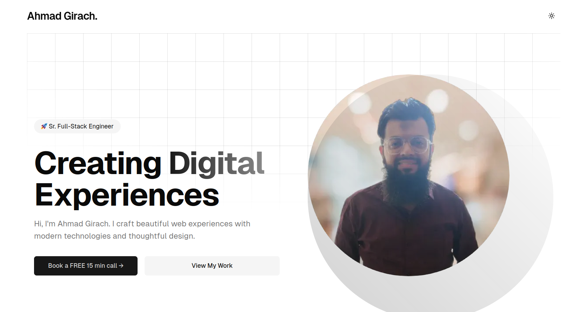

## 🚀 Project Overview
A simple yet modern portfolio application template.



## 🛠 Tech Stack
- Next.js 15
- TypeScript
- Tailwind CSS
- Shadcn/ui
- Framer Motion

## 📦 Prerequisites
- Node.js (v20+)
- npm (v9+) or Yarn
- Git

## 🔧 Installation & Setup

### Clone the Repository
```bash
https://github.com/ahmadgirach/ahmadgirach.com.git
cd [ahmadgirach.com]
```

### Install Dependencies
```bash
npm install
# or
pnpm install
# or
yarn install
```

## 🚀 Running the Application

### Development Mode
```bash
npm run dev
# or
pnpm dev
# or
yarn dev
```
## 🤝 Contributing
1. Fork the repository
2. Create your feature branch (`git checkout -b feature/AmazingFeature`)
3. Commit changes (`git commit -m 'Add some AmazingFeature'`)
4. Push to branch (`git push origin feature/AmazingFeature`)
5. Open a Pull Request

## 📄 License
Distributed under the MIT License. See `LICENSE` for more information.

## 🌟 Support
If you like this project, consider giving it a star. 🌟